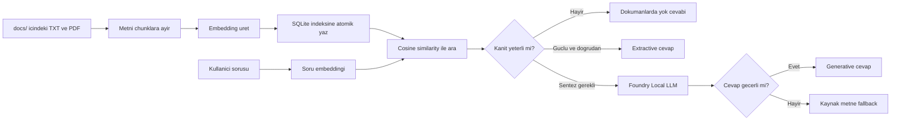

# Local RAG Assistant

Yerel TXT ve PDF dokumanlarinda anlamsal arama yapan, buldugu kanita dayanarak
Turkce cevap veren terminal tabanli bir RAG uygulamasi.

Proje, dokumanlari cihazdan disari gondermeden indekslemek ve yerel bir dil
modeliyle cevaplamak uzere tasarlanmistir. Bir model egitmez veya fine-tuning
yapmaz; mevcut dokumanlardan ilgili parcalari bulup cevaba baglam saglar.

## Neler Sunuyor?

- UTF-8 TXT ve metin tabanli PDF destegi
- Cumle ve kelime sinirlarini gozeten overlap'li chunking
- Cok dilli, 384 boyutlu yerel embedding modeli
- SQLite icinde atomik chunk, embedding ve kaynak manifesti yonetimi
- Cosine similarity ile semantic retrieval
- Kanita gore `extractive`, `generative` ve `fallback_extractive` cevap modlari
- Zayif kanitta LLM'i calistirmadan guvenli kapsam disi cevabi
- Kaynak dosya, PDF sayfasi, chunk kimligi ve benzerlik skoru gosterimi
- Indeks guncelligi, sistem sagligi ve model cache kontrolleri
- Guvenli dokuman ekleme/silme komutlari
- Model kalite ve hiz benchmark'i
- Rich tabanli Turkce terminal arayuzu

## RAG Akisi



Uygulama yeterli kanit bulamazsa tam olarak su cevabi verir:

```text
Bu bilgi verilen dokumanlarda yok.
```

## Teknoloji Yigini

| Katman | Teknoloji |
|---|---|
| Dil | Python 3.11+ |
| Embedding | `sentence-transformers/paraphrase-multilingual-MiniLM-L12-v2` |
| Yerel LLM | Microsoft Foundry Local, varsayilan `phi-4-mini` |
| Retrieval | scikit-learn L2 normalization ve NumPy normalized dot product |
| Veri deposu | SQLite, JSON olarak saklanan embeddingler |
| PDF okuma | `pypdf` |
| Terminal arayuzu | `rich` |

## Kurulum

Gereksinimler:

- Python 3.11 veya daha yeni bir surum
- Microsoft Foundry Local kurulumu
- Foundry Local cache'inde `phi-4-mini` modeli

Repository'yi hazirla:

```bash
git clone https://github.com/ErdemAbaci/LocalRAGApp.git
cd LocalRAGApp
python3.11 -m venv .venv
source .venv/bin/activate
python -m pip install --upgrade pip
pip install -e .
```

Kurulumu inference calistirmadan kontrol et:

```bash
local-rag doctor
```

`doctor`, dokumanlari, indeks durumunu, veritabanini, embeddingleri, Foundry
Local kurulumunu ve model cache'ini kontrol eder. Bir sorun varsa cozum onerisi
de gosterir.

## Ilk Calistirma

1. TXT veya PDF dosyalarini `docs/` klasorune koy.
2. Indeksi olustur.
3. Interaktif terminali ac veya tek soru sor.

```bash
local-rag reindex
local-rag
```

Interaktif oturumda soruyu dogrudan yazabilirsin:

```text
rag> Veri madenciligi surecleri nedir?
```

Tek seferlik kullanim:

```bash
local-rag ask "Veri madenciligi surecleri nedir?"
```

`python main.py` komutu da geriye donuk olarak ayni interaktif oturumu acar.

## CLI Komutlari

### Terminal alt komutlari

```text
local-rag ask "RAG nedir?"
local-rag add "/dosya/yolu/notlar.pdf"
local-rag remove "notlar.pdf"
local-rag remove "notlar.pdf" --yes
local-rag reindex
local-rag stats
local-rag sources
local-rag doctor
local-rag model
local-rag config
local-rag benchmark --models phi-4-mini phi-3.5-mini
local-rag --help
```

### Interaktif oturum komutlari

| Komut | Gorevi |
|---|---|
| `/help` | Komut listesini gosterir. |
| `/stats` | Indeks, model ve esik bilgilerini gosterir. |
| `/model` | Model, cache ve lazy-load durumunu gosterir. |
| `/config` | Aktif RAG ayarlarini salt okunur gosterir. |
| `/sources` | Indeksteki dosya, sayfa ve chunk sayilarini listeler. |
| `/doctor` | Sistem bilesenlerini kontrol eder. |
| `/add <yol>` | TXT veya PDF dosyasini `docs/` klasorune ekler. |
| `/remove <dosya>` | Dokumani onay alarak siler. |
| `/benchmark [model ...]` | Modellerin hiz ve cevap kalitesini karsilastirir. |
| `/reindex` | Dokumanlari yeniden indeksler. |
| `/debug on` | Teknik hata ve Foundry ciktilarini acar. |
| `/debug off` | Teknik ciktilari kapatir. |
| `/exit` | Oturumu kapatir. |

`add` ve `remove` islemleri otomatik embedding uretmez. Dokuman degisikliginden
sonra uygulamanin bildirdigi gibi `local-rag reindex` calistirilmalidir.

## Model Secimi

Varsayilan model `phi-4-mini`dir. Kodu degistirmeden farkli bir Foundry Local
modeli denemek icin ortam degiskeni kullanilabilir:

```bash
LOCAL_RAG_MODEL=phi-3.5-mini local-rag
```

Aktif secimi kontrol etmek icin:

```bash
local-rag model
local-rag config
```

Model ve embeddingler lazy-load edilir. Bu nedenle ilk soru sonraki sorulardan
daha yavas olabilir; ayni oturumdaki ikinci soru warm generation suresini daha
iyi gosterir.

## Benchmark

Benchmark, her modele ayni sabit RAG contextlerini verir ve su metrikleri olcer:

- model yukleme suresi
- ilk (cold) cevap suresi
- sonraki (warm) cevaplarin ortalama suresi
- gecerli cevap sayisi
- beklenen anahtar terim kapsami

Son dogrulanan yerel sonuc:

| Model | Yukleme | Ilk cevap | Warm ortalama | Gecerli | Terim kapsami |
|---|---:|---:|---:|---:|---:|
| `phi-4-mini` | 31.307 sn | 5.092 sn | 4.747 sn | 3/3 | %89 |
| `phi-3.5-mini` | 10.571 sn | 8.971 sn | 8.681 sn | 2/3 | %56 |

Sonuclar donanima, model cache'ine ve Foundry Local surumune gore degisebilir.
Tam rapor Git'e eklenmeyen `data/model_benchmark.json` dosyasina yazilir.

## Test ve Degerlendirme

```bash
python -m py_compile main.py eval.py app/*.py tests/*.py
python -m unittest discover -s tests -v
python eval.py
```

Embedding modeli daha once cache'e alinmissa eval agsiz calistirilabilir:

```bash
HF_HUB_OFFLINE=1 TRANSFORMERS_OFFLINE=1 python eval.py
```

Son dogrulanan durumda:

- `81/81` birim testi basarili
- `11/11` retrieval ve cevap kalite kontrolu basarili
- 3 kaynak dosya ve 16 chunk saglikli

Eval seti yalnizca dogru kaynak ve skoru degil, beklenen chunk kavramlarini ve
kapsam disi sorularin LLM'e gonderilmeden reddedilmesini de kontrol eder.

## Proje Yapisi

```text
.
|-- app/
|   |-- benchmark.py       # Model hiz ve cevap kalite karsilastirmasi
|   |-- cli_output.py      # Rich terminal gorunumu
|   |-- config.py          # Retrieval ve cevap esikleri
|   |-- database.py        # SQLite semasi ve atomik yazimlar
|   |-- document_manager.py # Guvenli dokuman ekleme/silme
|   |-- embeddings.py      # Embedding lazy-load ve cache yonetimi
|   |-- health.py          # Doctor kontrolleri
|   |-- index_state.py     # SHA-256 indeks guncelligi
|   |-- ingest.py          # TXT/PDF okuma ve chunking
|   |-- llm.py             # Foundry Local ve cevap kalite kontrolu
|   |-- prompts.py         # Turkce RAG promptu
|   `-- retrieval.py       # Cosine similarity ve siralama
|-- docs/                  # Indekslenecek kullanici dokumanlari
|-- tests/                 # Deterministik birim ve entegrasyon testleri
|-- benchmark_cases.json   # Model benchmark vakalari
|-- eval_cases.json        # Retrieval regression vakalari
|-- eval.py                # Eval calistiricisi
|-- main.py                # Interaktif ve argparse CLI entrypoint'i
|-- PROJECT_GUIDE.md       # Ayrintili, ogretici teknik dokumantasyon
`-- pyproject.toml         # Paket ve local-rag console script tanimi
```

## Tasarim Kararlari

- **Local-first:** Dokuman, embedding ve uretilen indeks yerelde kalir.
- **Guvenilirlik:** Kanit zayifsa model tahmin yapmaz; sabit kapsam disi cevabi
  kullanilir.
- **Atomik reindex:** Hazirlama veya SQLite yazimi basarisiz olursa eski indeks
  korunur.
- **Kaynak ayrimi:** Model cevabina parca etiketleri yazdirilmaz; kaynaklar ayri
  tabloda gosterilir.
- **Lazy loading:** LLM yalnizca generative cevap gerektiginde yuklenir.
- **Olculebilir gelisim:** Retrieval, fallback ve cevap temizligi deterministik
  testlerle korunur.

Daha ayrintili mimari anlatim ve ogrenme notlari icin
[`PROJECT_GUIDE.md`](PROJECT_GUIDE.md) dosyasina bakabilirsin.

## Bilinen Sinirlamalar

- Goruntu tabanli PDF'ler icin OCR destegi yoktur.
- Turkce gramer kalitesi tam olarak otomatik olculemez.
- Tum embeddingler arama sirasinda bellege alinir; mevcut yapi kucuk ve orta
  koleksiyonlara yoneliktir.
- SQLite icinde JSON embedding saklamak V1 ve ogrenme amaci icin uygundur,
  buyuk veri setleri icin vector database gerekebilir.
- Konusma gecmisi ve takip sorusu cozumleme henuz yoktur.
- Uygulama su anda repository kok dizininden calistirilmalidir.

## Yol Haritasi

CLI, indeks yonetimi, eval ve model benchmark asamalari tamamlandi. V2 icin
degerlendirilecek ana yonler:

- FastAPI ile `ask`, `reindex` ve `stats` endpointleri
- Streamlit ile dokuman ve soru-cevap arayuzu
- Kaynak filtresi ve chunk goruntuleme
- Neighbor chunk genisletme veya reranking
- Conversation history ve takip sorulari
- OCR destegi
- Daha buyuk koleksiyonlar icin vector database degerlendirmesi

## Lisans

Bu proje [MIT Lisansi](LICENSE) ile lisanslanmistir.
