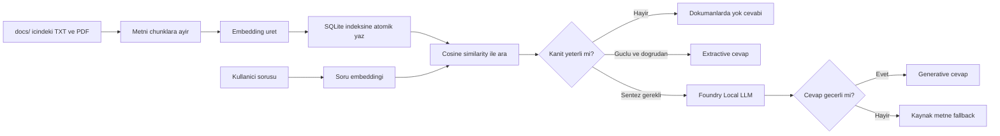

# Local RAG Assistant

Yerel TXT ve PDF dokumanlarinda anlamsal arama yapan, buldugu kanita dayanarak
Turkce cevap veren terminal tabanli bir RAG uygulamasi.

Proje, dokumanlari cihazdan disari gondermeden indekslemek ve yerel bir dil
modeliyle cevaplamak uzere tasarlanmistir. Bir model egitmez veya fine-tuning
yapmaz; mevcut dokumanlardan ilgili parcalari bulup cevaba baglam saglar.

## Neler Sunuyor?

- UTF-8 TXT ve metin tabanli PDF destegi
- Embedding modelinin 128 token sinirina uygun, cumle odakli token-aware chunking
- Cok dilli, 384 boyutlu yerel embedding modeli
- SQLite icinde atomik chunk, embedding ve kaynak manifesti yonetimi
- Cosine similarity ile semantic retrieval
- Relevance ile secilen, belge sirasiyla modele verilen context
- Esik alti komsulari disarida birakan sinirli onceki/sonraki context genisletme
- Kanita gore `extractive`, `generative` ve `fallback_extractive` cevap modlari
- Zayif kanitta LLM'i calistirmadan guvenli kapsam disi cevabi
- Kaynak dosya, PDF sayfasi, chunk kimligi ve benzerlik skoru gosterimi
- Indeks guncelligi, sistem sagligi ve model cache kontrolleri
- Guvenli dokuman ekleme/silme komutlari
- Chunk metnini ID ile inceleme ve kaynak bazli arama filtresi
- Her klasorden calisma, proje bazli gecmis ve canli slash komut menusu
- Model/kaynak/indeks/filtre durum satiri ve baglamsal komut ipuclari
- Arama, model hazirlama ve yanit icin tek satirli asama gostergesi
- Uretken cevaplarda token geldikce guncellenen canli yanit ve guvenli iptal
- Oturum ici soru/cevap gecmisi, yeniden calistirma ve Markdown/JSON export
- `Ctrl+L`, `Esc` ve baglama duyarli `Ctrl+C` klavye kisayollari
- Model kalite ve hiz benchmark'i
- Rich ve prompt-toolkit tabanli Turkce terminal arayuzu

## RAG Akisi


```mermaid
flowchart LR
    A["docs/ icindeki TXT ve PDF"] --> B["Metni chunklara ayir"]
    B --> C["Embedding uret"]
    C --> D["SQLite indeksine atomik yaz"]
    Q["Kullanici sorusu"] --> E["Soru embeddingi"]
    D --> F["Cosine similarity ile ara"]
    E --> F
    F --> G{"Kanit yeterli mi?"}
    G -- "Hayir" --> H["Dokumanlarda yok cevabi"]
    G -- "Guclu ve dogrudan" --> I["Extractive cevap"]
    G -- "Sentez gerekli" --> J["Foundry Local LLM"]
    J --> K{"Cevap gecerli mi?"}
    K -- "Evet" --> L["Generative cevap"]
    K -- "Hayir" --> M["Kaynak metne fallback"]
```

Uygulama yeterli kanit bulamazsa tam olarak su cevabi verir:

```text
Bu bilgi verilen dokümanlarda yok.
```

## Teknoloji Yigini

| Katman | Teknoloji |
|---|---|
| Dil | Python 3.11+ |
| Embedding | `sentence-transformers/paraphrase-multilingual-MiniLM-L12-v2` |
| Yerel LLM | Microsoft Foundry Local, varsayilan `phi-4-mini` |
| Retrieval | scikit-learn L2 normalization ve NumPy normalized dot product |
| Veri deposu | SQLite, JSON olarak saklanan embeddingler |
| PDF okuma | `pypdf` |
| Terminal arayuzu | `rich`, `prompt-toolkit` |

## Kurulum

Gereksinimler:

- Python 3.11 veya daha yeni bir surum
- Microsoft Foundry Local kurulumu
- Foundry Local cache'inde `phi-4-mini` modeli

Repository'yi hazirla:

```bash
git clone https://github.com/ErdemAbaci/LocalRAGApp.git
cd LocalRAGApp
python3.11 -m venv .venv
source .venv/bin/activate
python -m pip install --upgrade pip
pip install -e .
```

Kurulumu inference calistirmadan kontrol et:

```bash
local-rag doctor
```

`doctor`, dokumanlari, indeks durumunu, veritabanini, embeddingleri, Foundry
Local kurulumunu ve model cache'ini kontrol eder. Bir sorun varsa cozum onerisi
de gosterir.

## Ilk Calistirma

1. TXT veya PDF dosyalarini `docs/` klasorune koy.
2. Indeksi olustur.
3. Interaktif terminali ac veya tek soru sor.

```bash
local-rag reindex
local-rag
```

Interaktif oturumda soruyu dogrudan yazabilirsin:

```text
> Veri madenciligi surecleri nedir?
```

Tek seferlik kullanim:

```bash
local-rag ask "Veri madenciligi surecleri nedir?"
```

`python main.py` komutu da geriye donuk olarak ayni interaktif oturumu acar.

## CLI Komutlari

### Terminal alt komutlari

```text
local-rag ask "RAG nedir?"
local-rag ask --source example.txt "RAG nedir?"
local-rag add "/dosya/yolu/notlar.pdf"
local-rag remove "notlar.pdf"
local-rag remove "notlar.pdf" --yes
local-rag reindex
local-rag stats
local-rag sources
local-rag show 156
local-rag doctor
local-rag model
local-rag config
local-rag benchmark --models phi-4-mini phi-3.5-mini
local-rag --help
```

### Interaktif oturum komutlari

| Komut | Gorevi |
|---|---|
| `/help` | Komut listesini gosterir. |
| `/stats` | Indeks, model ve esik bilgilerini gosterir. |
| `/model` | Model, cache ve lazy-load durumunu gosterir. |
| `/config` | Aktif RAG ayarlarini salt okunur gosterir. |
| `/sources` | Indeksteki dosya, sayfa ve chunk sayilarini listeler. |
| `/show <chunk-id>` | Chunk metadata'sini ve tam kaynak metnini gosterir. |
| `/filter <dosya\|off>` | Oturumdaki aramalari bir kaynakla sinirlar veya filtreyi kapatir. |
| `/ask [--source dosya] <soru>` | Kalici filtreyi degistirmeden tek soru sorar. |
| `/history` | Bu oturumda basariyla tamamlanan soru ve cevaplari listeler. |
| `/repeat [id]` | Son veya numarasi verilen soruyu ayni kaynak filtresiyle yeniden calistirir. |
| `/export <markdown\|json> [yol]` | Oturumu yapilandirilmis bir dosyaya aktarir. |
| `/doctor` | Sistem bilesenlerini kontrol eder. |
| `/add <yol>` | TXT veya PDF dosyasini `docs/` klasorune ekler. |
| `/remove <dosya>` | Dokumani onay alarak siler. |
| `/benchmark [model ...]` | Modellerin hiz ve cevap kalitesini karsilastirir. |
| `/reindex` | Dokumanlari yeniden indeksler. |
| `/debug on` | Teknik hata ve Foundry ciktilarini acar. |
| `/debug off` | Teknik ciktilari kapatir. |
| `/exit` | Oturumu kapatir. |

`add` ve `remove` islemleri otomatik embedding uretmez. Dokuman degisikliginden
sonra uygulamanin bildirdigi gibi `local-rag reindex` calistirilmalidir.

## Proje Yolu ve Terminal Deneyimi

Editable kurulumdan sonra `local-rag` herhangi bir klasorden calistirilabilir.
Varsayilan olarak kurulu Local RAG repository'sindeki `docs/` ve `data/`
yollari kullanilir.

Baska bir Local RAG calisma klasoru secmek icin global `--project` secenegini
alt komuttan once yaz:

```bash
local-rag --project /dosya/yolu/rag-calismasi stats
local-rag --project /dosya/yolu/rag-calismasi ask "RAG nedir?"
```

Kalici terminal tercihi icin ortam degiskeni kullanilabilir:

```bash
export LOCAL_RAG_HOME=/dosya/yolu/rag-calismasi
local-rag
```

Oncelik `--project`, `LOCAL_RAG_HOME`, varsayilan repository kokudur. Secilen
klasor var olmalidir; `docs/` ve `data/` bu kokun altinda aranir.

Interaktif terminalde giris alani cercevelidir. `/` yazildiginda komutlar ve
kisa aciklamalari girisin ustunde canli olarak acilir; ok tuslari secim yapar,
Tab aktif secimi tamamlar. Ayni tamamlama sistemi indeksli kaynak adlarini,
`/debug` degerlerini ve `/add` dosya yollarini da destekler. Yukari/asagi ok ile
onceki girdiler getirilebilir. Gecmis proje bazinda `data/cli_history` dosyasinda
yalnizca yerel olarak ve kullaniciya ozel dosya izniyle saklanir. Bu ozellik
konusma hafizasi degildir; eski sorular modele otomatik context olarak verilmez.

`/history` ise shell giris gecmisinden farkli olarak yalnizca mevcut uygulama
oturumunda basariyla tamamlanan RAG sonuclarini tutar. `/repeat` secilen soruyu
orijinal kaynak filtresiyle yeniden calistirir. `/export markdown` ve `/export
json` cevaplari, modlari, skorlari, sureleri ve kaynak metadata'sini varsayilan
olarak `data/exports/` altina yazar; tam chunk metinleri export edilmez ve var
olan dosyanin uzerine yazilmaz.

Komut adlari ve argumanlari yazilirken farkli renklendirilir. Parametre isteyen
bir komut secildiginde, ornegin `/show <chunk-id>`, kullanim bicimi giris
kutusunda gorunur. Kutunun altindaki kompakt satir aktif modeli, kaynak sayisini,
indeks guncelligini ve varsa kaynak filtresini gosterir. Bir soru calisirken
arama, model hazirlama ve yanit uretme ayri satirlar acmak yerine ayni ilerleme
satirinda asama asama guncellenir.

Uretken cevapta ilk token geldikten sonra ilerleme satiri canli cevap paneline
donusur. Generation sirasinda `Ctrl+C` akisi kapatir, kismi cevabi gecmise
eklemez ve oturumu acik tutar. Giris alaninda `Ctrl+C` yazili metni temizler;
alan zaten bossa oturumu kapatir. `Esc` acik onerileri kapatir, `Ctrl+L` terminal
gorunumunu temizler.

## Model Secimi

Varsayilan model `phi-4-mini`dir. Kodu degistirmeden farkli bir Foundry Local
modeli denemek icin ortam degiskeni kullanilabilir:

```bash
LOCAL_RAG_MODEL=phi-3.5-mini local-rag
```

Aktif secimi kontrol etmek icin:

```bash
local-rag model
local-rag config
```

Model ve embeddingler lazy-load edilir. Bu nedenle ilk soru sonraki sorulardan
daha yavas olabilir; ayni oturumdaki ikinci soru warm generation suresini daha
iyi gosterir.

## Benchmark

Benchmark, her modele ayni sabit RAG contextlerini verir ve su metrikleri olcer:

- model yukleme suresi
- ilk (cold) cevap suresi
- sonraki (warm) cevaplarin ortalama suresi
- gecerli cevap sayisi
- beklenen anahtar terim kapsami

Son dogrulanan yerel sonuc:

| Model | Yukleme | Ilk cevap | Warm ortalama | Gecerli | Terim kapsami |
|---|---:|---:|---:|---:|---:|
| `phi-4-mini` | 31.307 sn | 5.092 sn | 4.747 sn | 3/3 | %89 |
| `phi-3.5-mini` | 10.571 sn | 8.971 sn | 8.681 sn | 2/3 | %56 |

Sonuclar donanima, model cache'ine ve Foundry Local surumune gore degisebilir.
Tam rapor Git'e eklenmeyen `data/model_benchmark.json` dosyasina yazilir.

## Test ve Degerlendirme

```bash
python -m py_compile main.py eval.py app/*.py tests/*.py
python -m unittest discover -s tests -v
python eval.py
```

Embedding modeli daha once cache'e alinmissa eval agsiz calistirilabilir:

```bash
HF_HUB_OFFLINE=1 TRANSFORMERS_OFFLINE=1 python eval.py
```

Retrieval metriklerini baseline ile karsilastirmak icin:

```bash
python eval.py --compare
```

Son dogrulanan durumda:

- `175/175` birim testi basarili
- `14/14` retrieval ve cevap kalite kontrolu basarili
- 3 kaynak dosya ve 24 chunk saglikli; maksimum chunk uzunlugu 109 token

| Metrik | Deger |
|---|---:|
| Recall@1 | 0.6667 |
| Recall@3 | 0.9444 |
| Recall@5 | 1.0000 |
| MRR | 0.8333 |

Eval seti yalnizca dogru kaynak ve skoru degil, en iyi chunk veya modele giden
sinirli context icindeki beklenen kavramlari ve kapsam disi sorularin LLM'e
gonderilmeden reddedilmesini de kontrol eder. Ground truth chunk ID ile degil
**icerik imzasi** ile etiketlenir; boylece reindex ve chunking degisiklikleri
etiketleri gecersiz kilmaz.

Ayrica 6 **hard negative** vaka bulunur: konusu dokumana yakin ama cevabi
dokumanda olmayan sorular. Bunlarin tamami su anda mevcut esigi geciyor ve
`GAP` olarak raporlanip olculuyor, ancak pass/fail kapisini dusurmuyor. Olcum
onemli bir siniri gosterdi: cevabi dokumanda bulunmayan bir soru (0.5985),
cevabi bulunan bir sorudan (0.5570) daha yuksek skor alabiliyor. Bu nedenle
yanlis pozitif sorunu tek bir esik degeriyle cozulemez.

## Proje Yapisi

```text
.
|-- app/
|   |-- benchmark.py       # Model hiz ve cevap kalite karsilastirmasi
|   |-- cli_input.py       # Canli menu, durum satiri, ipuclari ve gecmis
|   |-- cli_output.py      # Rich tema ve asamali islem gostergesi
|   |-- config.py          # Retrieval ve cevap esikleri
|   |-- database.py        # SQLite semasi ve atomik yazimlar
|   |-- document_manager.py # Guvenli dokuman ekleme/silme
|   |-- embeddings.py      # Embedding lazy-load ve cache yonetimi
|   |-- health.py          # Doctor kontrolleri
|   |-- index_state.py     # SHA-256 indeks guncelligi
|   |-- ingest.py          # TXT/PDF okuma ve chunking
|   |-- llm.py             # Foundry Local ve cevap kalite kontrolu
|   |-- prompts.py         # Turkce RAG promptu
|   |-- project.py         # --project ve LOCAL_RAG_HOME yol cozumu
|   |-- rag_service.py     # Yapilandirilmis RAG sonuc ve karar akisi
|   |-- session.py         # Oturum gecmisi, tekrar verisi ve guvenli export
|   `-- retrieval.py       # Cosine similarity, filtreleme ve siralama
|-- docs/                  # Indekslenecek kullanici dokumanlari
|-- tests/                 # Deterministik birim ve entegrasyon testleri
|-- benchmark_cases.json   # Model benchmark vakalari
|-- eval_cases.json        # Retrieval regression vakalari
|-- eval.py                # Eval calistiricisi
|-- main.py                # Interaktif ve argparse CLI entrypoint'i
|-- PROJECT_GUIDE.md       # Ayrintili, ogretici teknik dokumantasyon
`-- pyproject.toml         # Paket ve local-rag console script tanimi
```

## Tasarim Kararlari

- **Local-first:** Dokuman, embedding ve uretilen indeks yerelde kalir.
- **Guvenilirlik:** Kanit zayifsa model tahmin yapmaz; sabit kapsam disi cevabi
  kullanilir.
- **Atomik reindex:** Hazirlama veya SQLite yazimi basarisiz olursa eski indeks
  korunur.
- **Kaynak ayrimi:** Model cevabina parca etiketleri yazdirilmaz; kaynaklar ayri
  tabloda gosterilir.
- **Lazy loading:** LLM yalnizca generative cevap gerektiginde yuklenir.
- **Olculebilir gelisim:** Retrieval, fallback ve cevap temizligi deterministik
  testlerle korunur.
- **Sunumdan bagimsiz cekirdek:** RAG servisi cevabi, kaynaklari ve sureleri
  yapilandirilmis nesneler olarak dondurur; Rich yalnizca bunlari gosterir.
- **Token siniri:** Chunklar karakter sayisiyla degil embedding tokenizer'iyla
  olculur; modelin goremeyecegi kuyruk metni uretilmez.
- **Context ayrimi:** Chunklar skorla secilir, LLM'e belge sirasiyla verilir;
  en iyi sonuca cok uzak eslesmeler ve esik alti komsular disarida birakilir.
- **Yanlis ret korumasi:** Retrieval yeterli kanit buldugu halde model
  `Bu bilgi verilen dokumanlarda yok.` derse cevap gecersiz sayilir. Fallback,
  soruyla en cok ortusen kaynak cumlelerini secerek guvenli bir cevap verir.
- **Guvenli oturum kaydi:** Yalnizca tamamlanan sonuclar oturum gecmisine girer;
  export kaynak metadata'sini tutar fakat tam chunk metinlerini tasimaz.

Daha ayrintili mimari anlatim ve ogrenme notlari icin
[`PROJECT_GUIDE.md`](PROJECT_GUIDE.md) dosyasina bakabilirsin.

## Bilinen Sinirlamalar

- Goruntu tabanli PDF'ler icin OCR destegi yoktur.
- Turkce gramer kalitesi tam olarak otomatik olculemez.
- Tum embeddingler arama sirasinda bellege alinir; mevcut yapi kucuk ve orta
  koleksiyonlara yoneliktir.
- SQLite icinde JSON embedding saklamak V1 ve ogrenme amaci icin uygundur,
  buyuk veri setleri icin vector database gerekebilir.
- Oturum gecmisi listeleme/tekrar/export icindir; onceki cevaplar henuz modele
  conversation context olarak verilmez ve takip sorulari cozumlenmez.

## Yol Haritasi

CLI, indeks yonetimi, eval, model benchmark, kaynak denetimi, proje yolu,
canli komut menusu, cerceveli giris, klavye kisayollari, streaming cevap,
guvenli iptal, oturum export'u, token-aware chunking ve komsu context tamamlandi.

Sonraki adimlar retrieval kalitesi ve **bu kaliteyi olcebilme yetenegi**
uzerinde ilerliyor. Siralamanin mantigi: ilk uc adim olcme yetenegi kazandirir,
sonrakiler ancak o yetenek varsa dogrulanabilir olur.

1. ~~**Eval guclendirmesi**~~ — **tamamlandi.** Recall@k ve MRR metrikleri,
   icerik imzasiyla etiketlenmis ground truth, bozuk etiket tespiti, 6 hard
   negative vaka ve `--compare` ile baseline karsilastirmasi.
2. **Chunking karsilastirma deneyi** — mevcut 110/20 disindaki konfigurasyonlari
   ayni eval setinde olcup secimi olcumle gerekcelendirme.
3. **Yanlis pozitif savunmasi** — esik kalibrasyonu, terim kanidi ve
   groundedness sinyali birlikte. Olcum tek basina esik ayarinin yetmedigini
   gosterdi.
4. **Hybrid search** — SQLite FTS5/BM25 ile dense retrieval'i birlestirme.
5. **Reranking** — genis aday havuzunu cross-encoder ile yeniden siralama.
   `Recall@5 = 1.0` dogru chunk'in her zaman aday havuzunda oldugunu, sorunun
   siralama oldugunu gosteriyor.
6. **Conversation history** — takip sorulari icin query rewriting.

Firsat buldukca: cevap groundedness kontrolu, incremental reindex, brute force
aramanin sinirini olcen olcekleme deneyi ve OCR destegi.

Kavram aciklamalari ve terim referansi icin
[`docs/LEARNING_NOTES.md`](docs/LEARNING_NOTES.md).

## Lisans

Bu proje [MIT Lisansi](LICENSE) ile lisanslanmistir.
